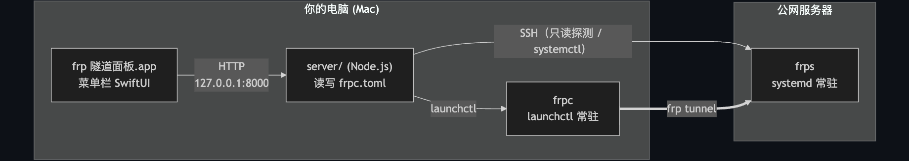

# frp 隧道面板

管理 [frp](https://github.com/fatedier/frp) 隧道的 macOS 菜单栏小工具。把本机跑的服务通过一台有公网 IP 的服务器暴露出去，加/删隧道、看连接状态、清日志、启停服务都在菜单栏点一点搞定，不用每次都手动改 `frpc.toml` 或者 SSH 上服务器查端口。



- `app/` —— 菜单栏 SwiftUI app，界面，逻辑都是调本机 `server/` 的 HTTP API
- `server/` —— 本机 Node.js/Express 服务，监听 `127.0.0.1:8000`，负责读写 `frpc.toml`、`launchctl` 控制本地 `frpc`、SSH 控制远程 `frps`
- 连接状态用真实信号判断：本地查 TCP 连接，远程查 `systemctl is-active`，不解析日志文字

## 环境要求

- macOS 26+（用了 Liquid Glass：`glassEffect` / `GlassEffectContainer` / `.buttonStyle(.glass)`）
- Xcode Command Line Tools 就够，不用装完整 Xcode（纯 Swift Package，没有 `.xcodeproj`）
- Node.js ≥ 18
- 一台公网服务器，SSH 能登录，装好 [frp](https://github.com/fatedier/frp) 的 `frps` 跑成 systemd 服务
- 本机的 `frpc` 二进制（[releases](https://github.com/fatedier/frp/releases) 下载对应平台）
- 一把单独生成的 SSH 密钥，给这个工具连服务器用，别用你日常登录的那把

## 配置

### 1. 远程服务器跑 frps

按 frp 官方文档配好，记下公网 IP、控制端口（默认 7000）、`auth.token`。

### 2. 本机装 frpc

```bash
mkdir -p ~/frp
# frpc 放到 ~/frp/frpc
```

`~/frp/frpc.toml`：

```toml
serverAddr = "<SERVER_IP>"
serverPort = 7000

[auth]
method = "token"
token = "<YOUR_TOKEN>"
```

`launchd/com.user.frpc.plist.template` 里的 `YOUR_USERNAME` 换成自己的用户名，存到 `~/Library/LaunchAgents/com.user.frpc.plist`：

```bash
launchctl load ~/Library/LaunchAgents/com.user.frpc.plist
```

### 3. 后端服务

```bash
cd server
npm install
```

环境变量（可选）：

| 变量 | 默认值 | 说明 |
|---|---|---|
| `FRP_SSH_KEY` | `~/.ssh/id_ed25519_frp_server` | 连服务器用的私钥 |
| `FRP_SSH_USER` | `root` | SSH 用户名 |

同样用 `launchd/com.user.frp-panel.plist.template` 改好路径存到 `~/Library/LaunchAgents/com.user.frp-panel.plist`：

```bash
launchctl load ~/Library/LaunchAgents/com.user.frp-panel.plist
```

先跑起来看看的话直接 `cd server && node server.js` 也行。

### 4. 菜单栏 app

```bash
cd app
./build.sh
```

编译、生成图标、打包成 `.app`、装到 `/Applications`，本地 ad-hoc 签名。首次打开 Gatekeeper 会拦一下，右键"打开"过一次就行。

开机自启：系统设置 → 通用 → 登录项加进去，或者

```bash
osascript -e 'tell application "System Events" to make login item at end with properties {path:"/Applications/frp 隧道面板.app", hidden:false}'
```

## 用法

- 点菜单栏图标开/关面板，右键有退出
- 图标颜色跟着隧道状态变（异常变红），15 秒轮询一次，面板开着的时候 5 秒一次
- 新增隧道会实时查端口占不占用（本机 `lsof`，远程 SSH 查 `ss`），冲突直接标红
- 名称不能重复；建议本地端口 = 远程端口，方便对照
- 日志能清空，启停/重载本地 frpc 时也会自动清一次

## 安全

- 后端只监听本机/局域网，`8000` 端口本身没走 frp 隧道往外暴露
- SSH 只用来跑只读探测和 `systemctl` 固定命令，不接用户输入拼接
- 建议单独开一把 SSH 密钥给这个工具用，不放心 root 就换个权限受限的用户

## 限制

只支持 macOS，远程端假设是 systemd。远程日志"清空"是按时间戳过滤，不是真删 journalctl 记录。一个面板对应 `frpc.toml` 里配的一台服务器。

## License

MIT
